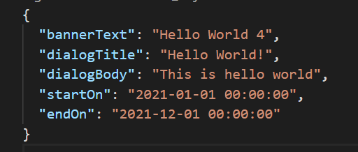
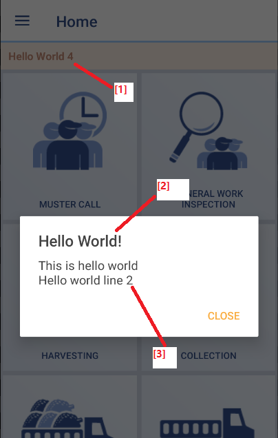

# quarto-connect-announcement

This repository serves as API endpoint of Quarto Connect app's announcement.

API hosted on [GitHub Pages](https://lintramax.github.io/quarto-connect-announcement/), append path `api/[variant]/announcement_v1.json` and it becomes app endpoints.

## API JSON scheme

- `bannerText {string}` - Title [1] of the announcement banner.
- `dialogTitle {string || null}` - Title of the dialog [2] 
- `dialogBody {string || null}` - Body of the dialog [3], supports multilines `\n`.
- `startOn {string}` - Announcement only appears after this date, format `yyyy-MM-dd HH:mm:ss` (UTC)
- `endOn {string}` - Announcement dissapear after this date, format `yyyy-MM-dd HH:mm:ss` (UTC)

** Strings are UTF-8 encoded.

## How to make new announcement in app?

1. Find `announcement_v1.json` in desired variant. e.g `api/release`
2. Update the json content accordingly.

App users will receive the announcement in their app once the update is reflected on GitHub Pages.

## When will app check for new announcement?

The checking is done at function `onResume()` of MainActivity.java.
